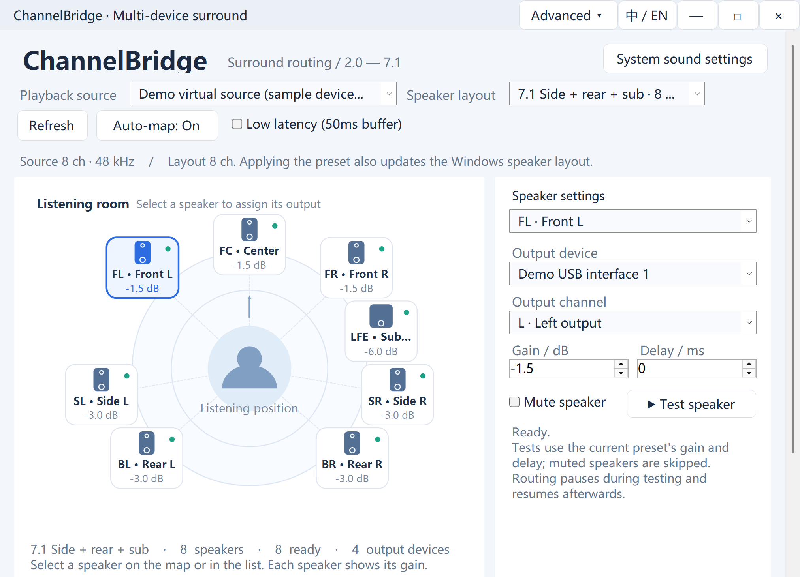

# ChannelBridge

[简体中文](README.md) · [Latest release](../../releases/latest) · [User guide](docs/User%20guide.md)

**Route one multichannel playback source to multiple stereo audio devices on Windows.**

Assign physical devices and L/R outputs on a visual speaker map. A Windows service handles playback independently of the configuration UI.



## Features

- 13 layouts from 2.0 through 7.1, including side/rear 5.1 variants.
- Per-speaker output assignment, gain, delay and mute.
- Automatic source-channel matching using the actual Windows speaker mask.
- Applying a preset also configures the virtual source's Windows speaker layout.
- Automatic service startup, saved run/stop intent, device reconnect retry.
- Source volume/mute following, individual and sequential speaker tests.
- Three microphone trials, median-based compensation, then three verification trials.
- Live Chinese/English switching with a remembered language choice.

## What's new in v1.0.1

- **Lower background CPU usage**: periodic format checks query only the selected source instead of enumerating every audio device. Temporary audio clients are disposed promptly.
- **Low latency and advanced buffers**: the low-latency preset requests **25ms capture / 50ms routing input / 20ms output**. Use **Advanced → Audio buffers** at the top right to edit each value, then apply the configuration. Settings persist across restarts and are used during microphone calibration.

Standard mode remains 100/80/40ms; profiles from the previous public release retain standard mode. 50ms is a queue target, not total playback latency. Drivers may adjust actual sizes, and smaller values may cause crackling. See the [release notes](docs/releases/v1.0.1.md).

## Getting started

1. Download the Windows x64 ZIP from [Releases](../../releases/latest), extract it and run `ChannelBridge.exe`. The .NET runtime is included.
2. Install [VB-CABLE](https://vb-audio.com/Cable/) or a compatible multichannel virtual playback device. The virtual driver is **not bundled** and has its own license.
3. Select **CABLE Input**, choose a layout, then assign each speaker's output device and L/R channel.
4. Click **Start routing**. Service installation and Windows layout changes may request administrator access.
5. Set Windows or your player to output to the selected virtual source. Use **System sound settings** at the top right if needed.

The release targets Windows x64; Windows 10 22H2 / Windows 11 with current updates is recommended. Compatibility depends on Windows, drivers and devices and is not verified for every combination. The executable is not commercially code-signed.

## Microphone alignment

Keep the microphone at the listening position, stop other audio, disable monitoring and keep volume unchanged. Each speaker is measured three times; medians set compensation relative to the slowest speaker. Three subsequent verification trials must pass before anything is saved.

Each triplet must have spread ≤10 ms and mean-to-median difference ≤5 ms. Across speakers, verified means and medians must both have spread ≤5 ms. Invalid, cancelled or failed measurements keep previous compensation. Audio remains in memory and is not saved to disk.

This is relative alignment, **not calibrated absolute latency measurement**. Real hardware trials have shown drift and missed detections; rejecting compensation in these cases is expected. Independent USB devices do not share a hardware clock, so permanent sample-accurate synchronization is not guaranteed.

## Limitations and configuration

No stereo upmixing, bass crossover or Dolby/DTS decoding. The virtual driver must support the selected format. Windows layout configuration uses an undocumented audio-policy interface with read-back validation and attempted rollback on failure. Microphone processing, room reflections, noise and dropped samples can invalidate measurements.

Service: `ChannelBridge.Audio`. Program: `%ProgramFiles%\ChannelBridge`. Configuration/status: `%ProgramData%\ChannelBridge`. Language preference: `%LocalAppData%\ChannelBridge\language.txt`. Closing the UI does not stop playback; Stop routing persists the stopped intent.

See the [user guide](docs/User%20guide.md) for details and service removal instructions in the [Chinese README](README.md#配置与服务).

## Build and release

On Windows x64 with PowerShell 7 and .NET 10 SDK:

```powershell
git clone https://github.com/dengyull/ChannelBridge.git
cd ChannelBridge
pwsh ./scripts/build.ps1
```

`artifacts/` contains the self-contained ZIP, SHA-256 checksum and check reports. Tests use synthetic signals and simulated devices. They do not install the service, play sound or record a microphone; UI checks briefly create windows.

GitHub Actions builds and validates branch/PR changes. Pushing a `vX.Y.Z` tag matching the project version builds on Windows and publishes the resulting ZIP and checksum through a draft release. The first public release is **v1.0.0**. Local development versions are not part of the public release history. The workflow uses only the built-in `GITHUB_TOKEN` with release-job write permission.

## License

[MIT](LICENSE). See [third-party notices](THIRD_PARTY_NOTICES.md) and `licenses/` for dependency/runtime terms. VB-CABLE is separately distributed and is not part of this project.
