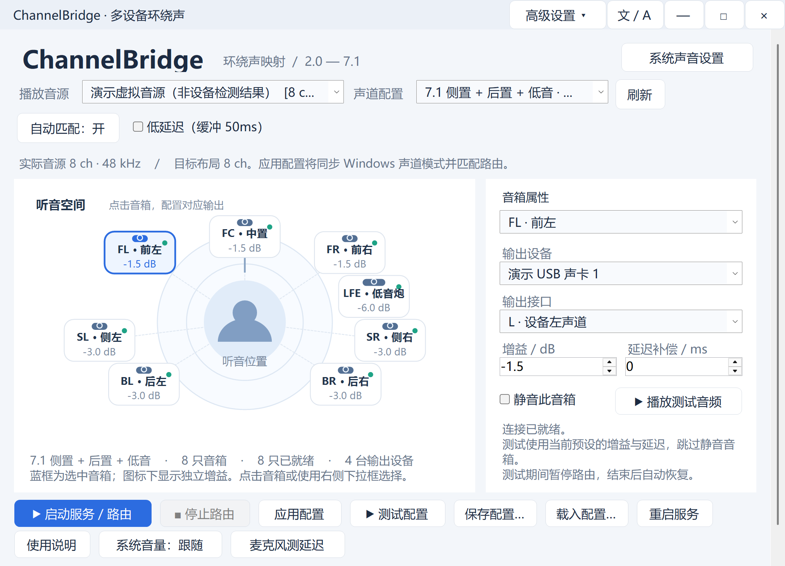

# ChannelBridge

[English](README.en.md) · [下载最新版本](../../releases/latest) · [使用说明](docs/使用说明.md)

**将一个多声道播放音源，分配到多个立体声音频设备。**

面向 Windows 的可视化音频路由工具，适合把独立 USB 声卡、桌面音箱等组合成环绕声系统。后台服务负责播放，界面用于配置和测试。



## 功能

- 支持 2.0、2.1、3.0、3.1、4.0、4.1、5.0、5.1 侧环绕、5.1 后环绕、6.0、6.1、7.0、7.1。
- 在音箱位置图上选择音箱，分配输出设备及 L/R，独立设置增益、延迟和静音。
- 按实际 Windows 声道位置自动匹配；应用预设时同步虚拟音源的 Windows 多声道模式。
- Windows 后台服务、开机恢复、设备离线重试；关闭界面不停止路由。
- 跟随所选播放音源的 Windows 音量和静音。
- 单音箱测试、按顺序测试全部音箱、麦克风三次测量和补偿复测。
- 中文 / English 即时切换；最小化按钮左侧的语言按钮会记住上次选择。

## v1.0.1 更新

- **降低后台 CPU 开销**：服务和界面仅查询当前音源的格式，避免定期扫描所有音频设备，并及时释放临时音频客户端。
- **低延迟及高级缓冲设置**：低延迟档默认采用捕获 **25ms**、转发输入 **50ms**、输出 **20ms**。右上角 **高级设置 → 音频缓冲** 可分别输入三个值，确定后点击 **应用配置**。支持保存、重启恢复，并用于麦克风测量。

标准档仍为 100/80/40ms；旧正式版配置默认保持标准档。50ms 是转发队列目标，不是总播放延迟。设备可能调整实际缓冲，更小的值可能导致爆音。详见 [更新说明](docs/releases/v1.0.1.md)。

## 下载与首次使用

1. 从 [Releases](../../releases/latest) 下载 `ChannelBridge-v1.0.1-win-x64.zip`（后续版本以对应版本号命名），解压后运行 `ChannelBridge.exe`。自带 .NET 运行时。
2. 安装 [VB-CABLE](https://vb-audio.com/Cable/) 或可用的多声道虚拟播放设备。VB-CABLE **不包含在发行包中**，请从官网获取并遵守其许可。
3. 选择 **CABLE Input** 为播放音源。首次使用若未检测到，程序会提示并打开官网下载页。
4. 选择声道布局，在右侧为每只音箱分配设备和 L/R，然后点击 **启动服务 / 路由**。服务安装和 Windows 声道设置在需要时请求管理员权限。
5. 将 Windows 默认播放设备或播放器输出设置为选中的虚拟音源。右上角 **系统声音设置** 可打开声音控制面板。

发布目标为 **Windows x64**，建议 Windows 10 22H2 / Windows 11，并保持系统更新。实际兼容性取决于 Windows、驱动和设备；并未对所有系统组合验证。发行程序未做商业代码签名。

## 麦克风测量

将麦克风固定在听音位置，暂停其他声音，关闭麦克风监听，保持音量不变。

- 每只已配置、未静音音箱测量三次，取中位数，以最慢音箱计算补偿。
- 临时应用补偿后，每只再复测三次；弹窗展示初测、复测、中位数、均值和极差。
- 单只音箱三次极差必须 ≤ **10 ms**，均值与中位数差 ≤ **5 ms**。
- 各音箱复测均值和中位数的最大差均须 ≤ **5 ms**，才自动保存补偿。
- 失败、取消或无效信号不会保存新补偿；录音仅在内存中处理，不写音频文件。

此功能用于相对对齐，**不是校准级绝对延迟测量**。真实设备测试曾出现延迟漂移和检测失败，保护性拒绝保存补偿属于预期行为。独立 USB 设备没有共享硬件时钟，软件补偿不能保证永久采样级同步。

## 范围与限制

- 只路由已有声道，不做立体声上混、低音分频、Dolby/DTS 解码。
- 虚拟驱动需提供相应多声道格式。自动 Windows 布局设置使用非公开音频策略接口，并读回校验；不兼容时会报告失败并尝试恢复。
- 独立设备存在缓冲与时钟漂移；麦克风增强、噪声、反射或设备丢帧可能导致测量失败。
- 系统音量跟随作用于选定音源。如果驱动已对捕获数据应用同一音量，可选择“直通”避免重复衰减。

## 配置与服务

服务名：`ChannelBridge.Audio`。安装位置：`%ProgramFiles%\ChannelBridge`。

配置和状态位于 `%ProgramData%\ChannelBridge`；语言设置位于 `%LocalAppData%\ChannelBridge\language.txt`。停止路由会保存停止意图，重启电脑不会擅自启动已停止的路由。

管理员 PowerShell 停止并注销服务：

```powershell
Stop-Service ChannelBridge.Audio
sc.exe delete ChannelBridge.Audio
```

此操作保留程序及配置文件。更多说明见 [中文使用说明](docs/使用说明.md)。

## 从源码构建

需要 Windows x64、Git、[.NET 10 SDK](https://dotnet.microsoft.com/download/dotnet/10.0) 和 PowerShell 7。

```powershell
git clone https://github.com/dengyull/ChannelBridge.git
cd ChannelBridge
pwsh ./scripts/build.ps1
```

输出位于 `artifacts/`：独立运行 ZIP、SHA-256 校验文件和验证报告。构建脚本运行模拟信号、路由生命周期及中英文 UI 检查；**不会安装服务、播放测试声或采集麦克风**。本地 UI 检查会短暂创建测试窗口。

## 自动发行

`.github/workflows/release.yml` 在分支推送 / PR 时构建验证；推送与项目版本一致的 `vX.Y.Z` 标签时，GitHub Actions 自动：

1. 在 Windows runner 恢复依赖并构建自带运行时的 x64 程序。
2. 运行验证，复制双语说明和第三方许可证，生成 ZIP 及 SHA-256。
3. 创建草稿 Release、上传 CI 构建产物，全部完成后公开发行。

首个公开版本为 **v1.0.0**；此前本地开发编号不作为 GitHub 发行历史。发布步骤仅使用仓库内置 `GITHUB_TOKEN`，无需额外 PAT。维护者需更新 `ChannelBridge.csproj`、`ServiceReport` 中的显示版本和相应发行说明，然后推送版本标签。

## 许可证

本项目采用 [MIT](LICENSE)。依赖及运行时的许可证和声明见 [THIRD_PARTY_NOTICES.md](THIRD_PARTY_NOTICES.md) 与 `licenses/`。VB-CABLE 独立分发，非本项目组成部分。
